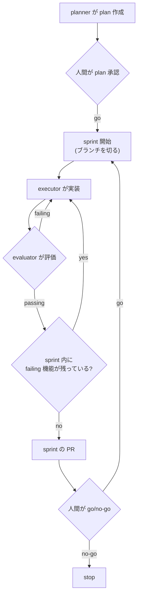

# Harness — 運用ルール (CLAUDE.md)

このプロジェクトは「長時間タスクを複数セッションにまたいで完遂する」ためのハーネスです。
モデル本体ではなく、この CLAUDE.md / agents / 状態ファイル群が "成否を決めるスキャフォールド" です。

メンタルモデル: ハーネス = モデル以外の全部。各部品は「今のモデルの弱点を補う一時的な足場」であり、
過剰に作り込まず最小限を狙う。

---

## 1. メンタルモデル (Fowler の 2×2)

|                          | Computational (決定的・速い)        | Inferential (AI判断・遅い)            |
| ------------------------ | ----------------------------------- | ------------------------------------- |
| Guide (事前に方向づけ)   | 型 / 規約 / `init.sh` / テンプレート / `DESIGN.md` | `planner` / `designer` (DESIGN.md を所有) |
| Sensor (事後に問題検知)  | lint / test / typecheck / DESIGN.md validate (`check.sh`)| `evaluator`                           |

原則: **速くて確実な検証は機械 (Computational) に任せ、AI エージェントは機械にできない意味判断だけに使う。**

UIアプリの視覚デザインは `DESIGN.md` (Google の DESIGN.md 形式) に固定する。これは Inferential Guide (`designer`)
が所有する成果物だが、機械可読な design token を持ち CLI で validate できるため、視覚の Computational Sensor にもなる。

---

## 2. 状態ファイル (コンテキスト外の記憶)

セッションをまたぐ記憶は会話履歴ではなく以下のファイルに置く。会話コンテキストは揮発する前提で扱う。

- `features.json` — 機能リスト・受け入れ基準・**sprint (機能を束ねた承認/実行の単位)**。**ここが唯一の信頼できる進捗ソース (single source of truth)**。
  - 各機能の `status` は `failing | passing` のみ。初期値は必ず `failing`。
  - `sprints[]` は順序付きの束。各 sprint の `status` は `planned | in_progress | done`。planner が切り、人間が plan 全体を1回承認し、go/no-go で sprint を `in_progress` にする。
  - **テストや受け入れ基準を削除・緩和してはならない。** 通すのはコードであって基準ではない。
  - Markdown ではなく JSON にしているのは、モデルが不用意に書き換えにくくするため。
- `progress.md` — 直近で何をしたか / 次に何をするか / 既知の問題 のメモ。
- git 履歴 — リカバリポイント。壊れたらコミットへ巻き戻す。
- `init.sh` — 依存インストールなどの環境構築。各セッション開始時に実行する。
  **サーバ起動はしない** (毎セッション起動するとポート競合するため)。e2e/ブラウザ検証で必要な時は `evaluator` が自分で起動する。
- `DESIGN.md` — (UIアプリのみ) ビジュアルアイデンティティ仕様。Google の DESIGN.md 形式 = YAML front matter の
  design token (機械可読・CLIで validate) + Markdown の rationale (理由)。`designer` が所有し repo に vendoring する。
  色・タイポ・余白は直書きせず、export したトークンを参照する。alpha 仕様なのでバージョンを固定する。

---

## 3. セッション開始ルーチン (毎回必ず実行)

1. `pwd` で作業ディレクトリを確認する。
2. `git log --oneline -10` と `progress.md` を読み、文脈を復元する。
3. `features.json` で現在地を特定する:
   - `in_progress` の sprint があればそれを継続する。無ければ最優先の `planned` sprint を対象にする。
   - **承認済みの plan がまだ無いなら §4 の plan フェーズから始める** (勝手に execute に入らない)。
   - 対象 sprint 内で `status: "failing"` かつ `depends_on` 充足済みの最優先の機能を、次の1つとして選ぶ。
4. `./init.sh` で依存関係・環境を整える (サーバは起動しない)。
5. **新しい作業を始める前に** `./scripts/check.sh` と既存 e2e テストを走らせ「今ちゃんと動くか」を確認する。
   - ここで壊れていたら、新機能より先にそれを直す。

---

## 4. ループ (plan は最初に書き切り、承認後は sprint 単位で自律実行する)

5回失敗などの停止条件やブランチ命名の細部はこの図には出さない。詳細は下の 4.1〜4.5 と §5 を正とする。

### 4.1 plan — 最初に1回、全部書き切る
- `planner` がゴールを **全機能に分解** し、受け入れ基準を `features.json` に書く。
- さらに機能を **順序付きの sprint に束ねる** (`sprints[]`)。各 sprint は「独立して PR/レビューを出せる意味のあるまとまり」で切る。
- (UIアプリのみ) design が要るなら `designer` が `DESIGN.md` を選定/生成・validate・所有する (新規 or 変更時のみ)。ソフトウェア構造 (アーキテクチャ / 技術選定) の判断は `planner` 側に寄せる。

### 4.2 承認ゲート — 1回だけ
- ファイルを書き換える *前に*、人間が **plan 全体 (全機能 + sprint 分割)** を承認する (Explore/Plan は自由、Execute の手前で止める)。
- 承認されたら **機能ごとの承認は取らず、自律実行に入る。** 人間が再び関与するのは §4.4 の停止条件のときだけ。

### 4.3 sprint ループ — 承認後、本体セッションが回す
承認済み sprint を優先度順に1つずつ `in_progress` にして回す。sprint を `in_progress` にしたら、
本体セッションがまず `sprint/<S-id>-<slug>` 作業ブランチを切る (main から分岐)。以降このブランチ上で進める。

各 sprint 内で:

1. **機能ループ**: sprint 内の failing 機能を優先度順・`depends_on` 充足順に **一度に1つだけ** 選ぶ。
   - `executor` が実装する (自己採点しない)。
   - `evaluator` が独立に採点する。`failing` ならエラー全文フィードバックを `executor` に戻して反復する。
   - `passing` になったら `features.json` の当該機能を `passing` にし、**その機能単位で git commit する** (sprint 末にまとめない)。
   - 次の failing 機能へ。
2. sprint の全機能が `passing` になったら、**その sprint の PR を出す** (機能ごとの commit が載った状態)。
3. sprint を `done` にし、**go/no-go チェックポイント**: 人間に「次 sprint へ進むか」を確認する。go なら次 sprint を `in_progress` にして繰り返す。

### 4.4 停止条件 — 自律ループから人間へ戻す
以下のいずれかで **必ず止まって人間へ返す**:
- 同一機能で **5 イテレーション失敗** (§5)。
- plan が想定していない **ブロッカー / 曖昧さ / スコープ外の判断** が要るとき。基準を勝手に緩めず、スコープを勝手に広げない。
- **sprint 境界の go/no-go**。

### 4.5 各機能・各 sprint 終了時の必須事項
- 環境を clean state (production-ready) に戻す。
- `progress.md` を更新する (どの sprint / 機能 / evaluator 判定)。
- **commit は機能ごと、PR は sprint ごと。** main へ直接 commit せず、sprint ごとに作業ブランチを切る (`sprint/<S-id>-<slug>`)。
- `evaluator` が `passing` を出した機能だけ `features.json` の `status` を更新する。

---

## 5. 動作基準 (ハードルール)

- **完了宣言の禁止**: `evaluator` が `passing` を出すまで、executor は機能を完了扱いにしてはならない。
- **1 機能ずつ (逐次)**: 複数機能を *同時* に実装しない (コンテキスト枯渇と未完了の原因)。ただし承認済み sprint は1セッションで逐次に走り切ってよい (「1 セッション 1 機能」ではない)。
- **生成 ≠ 評価**: 生成したエージェントに評価させない。
- **ループ上限**: 同一機能で 5 イテレーション失敗したら停止し、`progress.md` に状況を書いて人間へエスカレーションする。
- **承認は最小限**: 人間の承認は「plan 全体を1回」＋「sprint 境界の go/no-go」だけ。機能ごとの承認は取らず、executor↔evaluator の反復は自律で回す。
- **commit は機能ごと・PR は sprint ごと**: 機能が passing になるたびに commit する (sprint 末にまとめない)。sprint 完了で PR を出す。main へ直接 commit せず sprint ごとに作業ブランチを切る。
- **勝手に広げない**: 停止条件 (§4.4) に当たったら自律実行を止めて人間へ返す。基準の緩和・スコープ拡大・想定外の判断を独断で行わない。
- **エラーはそのまま渡す**: 失敗時は stack trace / エラー全文を次のエージェントへ渡す (要約しすぎない)。
- **重い探索はサブエージェントへ**: executor は広いコード探索をサブエージェントに委譲し、本体には 1,000〜2,000 トークンの凝縮要約だけを返させる。
- **JIT コンテキスト**: 最初から全部読み込まない。パス / クエリだけ持ち、必要時に動的ロードする。
- **再発したら supervision でなくハーネスを直す**: 同じ失敗が繰り返されたら、人手レビューを増やすのではなく Guide / Sensor (この CLAUDE.md・check.sh・agents) を改善する。
- **UI は DESIGN.md に準拠**: (UIアプリのみ) 色・タイポ・余白・コンポーネントは `DESIGN.md` のトークンに従う。値を直書きせず export したトークン (Tailwind / CSS 変数等) を使う。UI ライブラリ (shadcn/ui, MUI 等) を採用する場合も `DESIGN.md` のトークンはソースオブトゥルースのまま維持し、そのライブラリのテーマ機構 (Tailwind config / CSS 変数 / JS テーマオブジェクト等) へのマッピング層だけを置き換える。`DESIGN.md` を変更してよいのは `designer` だけ。
- **DESIGN.md は vendoring + バージョン固定**: 実行時に外部から取得しない。alpha 仕様なので固定し、更新時のみ `designer` が差し替える。
- **プレースホルダのまま UI を作らない**: テンプレ同梱の `DESIGN.md` はプレースホルダ。UIアプリでは `designer` が実物 (getdesign.md / designmd.app) へ差し替えてから UI を実装する。UI が無いアプリでは `DESIGN.md` を削除する。差し替え忘れは `check.sh` が警告する。
